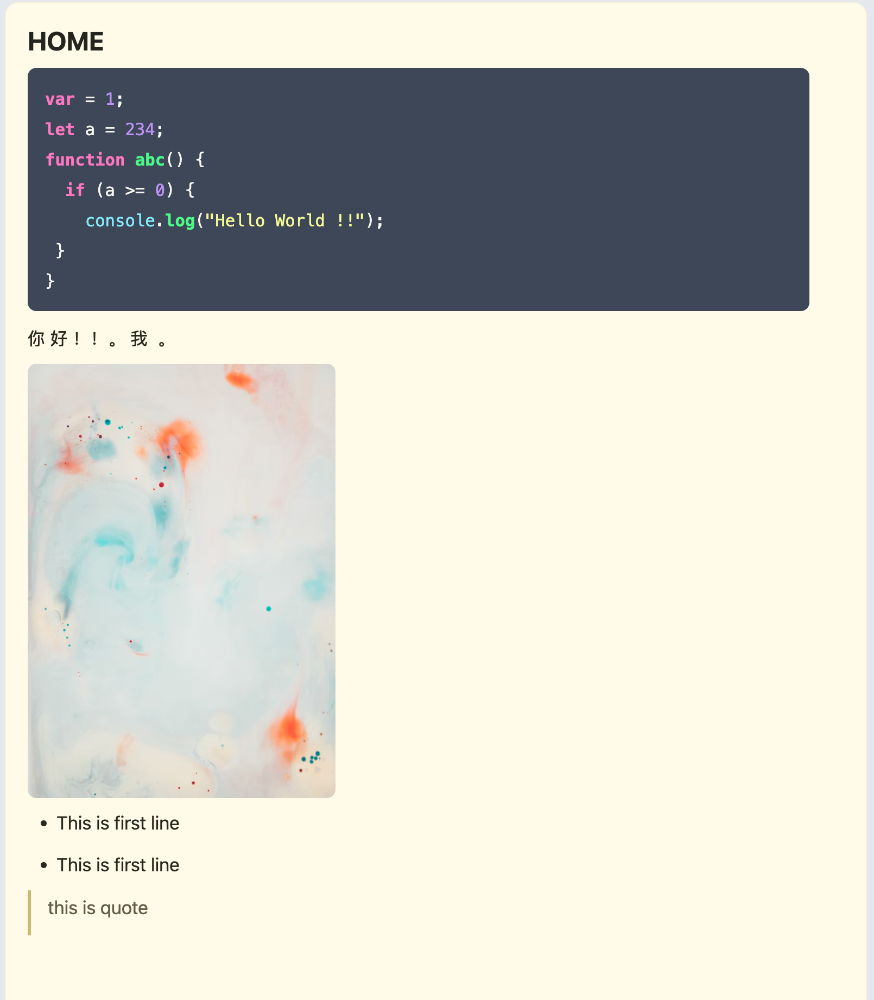

# Simple Note

A minimalist, Notion-like, zero-database web notepad. 
Fast, lightweight, and supports Markdown editing with live preview.



## Features
- **WYSIWYG Markdown Editor**: Powered by Tiptap. Type markdown and see it format instantly.
- **Auto-save**: Notes are automatically saved to text files on the server.
- **Zero Database**: All notes are stored as simple `.txt` files in the `data/` folder.
- **Syntax Highlighting**: Beautiful code blocks with Dracula theme.
- **Image & Link Support**: Easily paste image URLs and they render inline.
- **No Dependencies**: Backend is written in pure Node.js (no Express needed).

---

## 🚀 Quick Installation (One-line command)

You can install, update, or remove Simple Note using our automated script. It requires Node.js (v20+) to be installed on your system.

*Note: Replace `thaonv7995` with your actual GitHub username where you host this repository.*

### 1. Install

Run this command in your terminal:

```bash
curl -sL https://raw.githubusercontent.com/thaonv7995/simple-note/main/setup.sh | bash -s -- install
```
This will:
1. Clone the app to `~/.simple-note`.
2. Install dependencies and build the frontend bundle.
3. Automatically start it in the background using `pm2` on port **22099**.

You can then access your notes at: **[http://localhost:22099](http://localhost:22099)**

### 2. Update

To pull the latest changes and restart the app:

```bash
curl -sL https://raw.githubusercontent.com/thaonv7995/simple-note/main/setup.sh | bash -s -- update
```

### 3. Remove (Uninstall)

To completely remove the app:

```bash
curl -sL https://raw.githubusercontent.com/thaonv7995/simple-note/main/setup.sh | bash -s -- remove
```
*Don't worry! Before removing, the script will automatically backup your `data/` folder to your home directory, so you won't lose your notes.*

---

## Manual Setup

If you prefer to run it manually without the script:

1. Clone the repository
   ```bash
   git clone https://github.com/thaonv7995/simple-note.git
   cd simple-note
   ```
2. Install dependencies & Build
   ```bash
   npm install
   npm run build
   ```
3. Start the server
   ```bash
   PORT=22099 npm start
   ```

## Development

- Start server: `PORT=3001 npm start`
- Run tests: `npm test`
- Build frontend: `npm run build`
